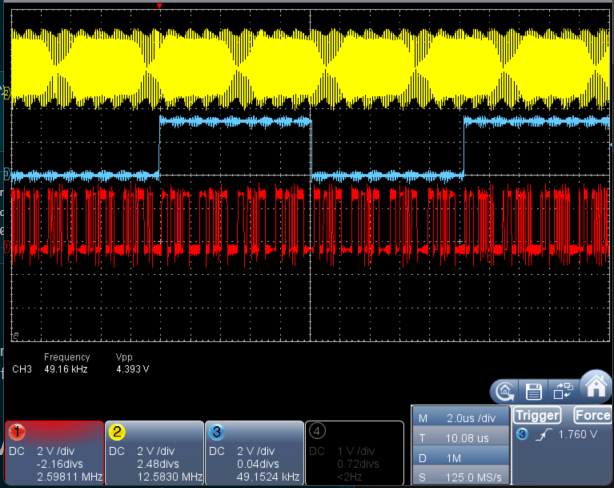

# nora-hal-dspic33ak-spi-i2s-tdm — SPI framed-mode I2S/TDM transport HAL

**NORA-HAL** — *Native On-chip Resource Assistant*

A compact, reusable SPI/I2S/TDM **transport** HAL for dsPIC33AK — part of **NORA-HAL**,
a HAL family whose public API is namespaced `nora_*` / `NORA_*`. It is carved from the
upstream audio project. It moves audio frames over a framed SPI peripheral with DMA
ping-pong and a per-instance block callback. It is intentionally **small**: it does not
try to be a turnkey "drop-in and forget" audio stack. Board-specific, failsafe, and
CMSIS-SAI buffer-semantics concerns stay in layers above it, so a project can extend
only what it needs.

> Want to run it on hardware first?
> Start with [dspic33ak-hal-starter](https://github.com/sulaolab/dspic33ak-hal-starter),
> which vendors validated snapshots of the NORA-HAL repositories and provides a
> ready-to-build MPLAB X project for the dsPIC33AK Curiosity board.

> **This repository is a published snapshot, not the development tree.** Every file under
> `src/` is byte-identical to its counterpart in `dspic33ak-hal-starter`, which is in turn
> byte-identical to the audio-board project that runs these sources on hardware. Fixes flow
> *into* here from that validated tree — see [docs/nora_migration.md](docs/nora_migration.md).
>
> **One exception, 2026-08-09.** Documentation and comment corrections under `src/`
> were made here first, ahead of the audio-board upstream. **No executable code
> changed.** The exact files and corrections are listed in
> [docs/nora_migration.md](docs/nora_migration.md).

Oscilloscope capture from the dspic33ak-hal-starter TDM8 **master** smoke demo
running on a dsPIC33AK Curiosity board (MikroBUS-A pins, no codec). BCLK
~12.5 MHz (yellow); frame sync FS ~49 kHz (blue) — here the **50%-duty** LRCLK-style
FS produced by the HAL's `fs_shape = FS_50PCT` option (CLC10-generated, BCLK/FS = 256);
DataOut with 8 × 32-bit slots (red). This HAL drives the signal. The integrating
project supplies board routing, DMA-channel allocation, and global DMA initialization;
the HAL programs and arms the channels — see
[dspic33ak-hal-starter](https://github.com/sulaolab/dspic33ak-hal-starter) for
a complete worked example.

## 0. Naming

The public API is `nora_*` / `NORA_*`. It replaces the `dspic33ak_*` / `DSPIC33AK_*`
namespace this repository used before 2026-08, and **there are no compatibility aliases** —
a consumer moving to this version renames its call sites. The substitution is textual:
`dspic33ak_` → `nora_`, `DSPIC33AK_` → `NORA_`, and that includes the conf-header macros
(`DSPIC33AK_TDM_*` → `NORA_TDM_*`).

The chip name survives in exactly two places, both deliberate:

- **Implementation file names** carry a backend tag: `nora_spi_i2s_tdm_dspic33ak.c` is the
  dsPIC33AK backend of the processor-neutral `nora_spi_i2s_tdm.h`. A second processor would
  add `nora_spi_i2s_tdm_<tag>.c` beside it, not a second header. The tagged
  `_dspic33ak_hw.{c,h}`, `_dspic33ak_reg.h`, `_dspic33ak_fs_clc.{c,h}`, `_dspic33ak_diag.c`
  and `_dspic33ak_diag_fast.h` files are backend-private.
- **Backend-private identifiers** inside those files: the device adapter
  `NORA_SPI_I2S_TDM_DSPIC33AK_DEVICE` / `..._DEV_AK512` / `..._DEV_AK128`, the register-layer
  masks, `nora_spi_i2s_tdm_hw_*`, and the `..._dspic33ak_sumprof_*` hot-path inlines — none
  of which a consumer of the public headers sees.

The tag is `_dspic33ak`, the device family this backend actually drives — not `_dspic33a`,
which is the *core* family name (dsPIC33A) and one level too coarse. A dsPIC33CK backend
would be tagged `_dspic33ck`: a different silicon family (dsPIC33**C**), and never
abbreviated to `_dspic33c`.

## 1. What this HAL does

- dsPIC33AK SPI framed mode (AUDEN=0, FRMEN=1) used as an I2S/TDM transport.
- RX/TX ping-pong DMA, double-buffered.
- One per-instance block callback per physical SPI: `cb(src, dst, user)`.
- Selectable frame-sync waveform via `config.fs_shape` (the app states intent; the HAL
  hides FRMSYPW/FRMCNT/CLC):
  - `FS_PULSE` — short ~1-BCLK frame sync (DSP/TDM short sync).
  - `FS_50PCT` — 50%-duty FS (I2S LRCLK style). I2S is native (FRMSYPW=1); a TDM **master**
    gets a ~50%-duty FS synthesized by **CLC10** (a J-K flip-flop toggled by a half-frame
    FRMSYNC marker, fed internally via virtual pin RPV8) on the same FS pin — no app/CLC code
    and no extra pin (the FS pin is auto-detected by PPS reverse-lookup). A TDM slave receives
    FS as an input, so `fs_shape` is accepted but has no generated-waveform effect (the value is
    still validated and, within a sync domain, compared as a framing field). See
    `nora_spi_i2s_tdm_dspic33ak_fs_clc.{c,h}`.
- Two configure/lifecycle paths (see "Configuration model" at the end):
  - **System** (recommended, multi-leg): `configure_system(setups, count)` applies ALL legs
    transactionally (all-or-nothing), then `open()` + `start_all_domains()`.
  - **Single-instance**: `inst_configure(inst, cfg)` + `open()` + `inst_start(inst)`.
  `open()` takes **no role** — it derives the clock role from the committed primary leg.
  Stop a SINGLE stream with `inst_stop()`, or a SYSTEM stream with `stop_domain()` /
  `stop_all_domains()`, then `close()` to clear the shared open-state. `close()` is a near-no-op:
  it does NOT tear down board pin routing or the external clock. Plus `get_status` / `get_load`
  diagnostics (block count, deadline-miss, ISR load) — the arg-less ones report the primary leg.
- Optional board/clock **port** hook (`set_port()`) for pin/CLC routing and external-clock
  bring-up/readiness — the core calls only through this registered port.
- Per-instance SPI framed-transport health diagnostics (`SPIROV` / `SPITUR` / `FRMERR`, sampled
  once per completed RX block) — see "DMA and SPI transport-health diagnostics" below.
- Multi-instance: the core owns a dense logical leg table. The default bank maps rows 0/1 to
  physical SPI1/SPI2; `NORA_TDM_BASE_ON_SPI34` explicitly maps those same rows to SPI3/SPI4.
  `spi1()`...`spi4()` always mean literal physical peripherals, while application-semantic legs
  use `inst(0)`/`inst(1)`. `conf.h` supplies each leg's RX/TX DMA channels, geometry, and initial
  `SYNC_DOMAIN`; per-leg format / clock role come from the runtime config. The core defines the
  leg enum, ping-pong buffers, leg table, and `_DMA<rx>Interrupt` vectors in explicit C.

## 2. What this HAL does NOT do

- No codec init (e.g. WM8904) — that is board/app code.
- No general board pin routing in the core — board FS/BCLK/DATA/MCLK routing is supplied by
  the registered port hook. **Exception:** for `TDM master + FS_50PCT`, the HAL-owned CLC10
  helper (`nora_spi_i2s_tdm_dspic33ak_fs_clc.*`) does touch PPS/CLC — it temporarily repoints the
  already-routed `SSx` FS pin to `CLC10OUT` (and routes `SSx`→RPV8) and restores it on
  `release()`. This is the one place the core itself drives PPS/CLC.
- No DSP — the callback owns any processing.
- No sample-rate policy — the transport is rate-agnostic (runs at the configured BRG or
  the incoming external clock); the supported-rate set is an app concern.
- No failsafe / board-specific teardown in the core — `close()` is a near-no-op; pin/clock
  release is left to the integrator (a future optional port deinit hook, not included).
- No CMSIS-SAI types in the core — `ARM_SAI_*` must not appear here.
- No automatic recovery from SPI framed-transport health-flag events (`SPIROV` / `SPITUR` /
  `FRMERR`) — the HAL only records per-RX-block observations (see "DMA and SPI transport-health
  diagnostics" below); deciding how to react (log, mute, restart the stream, ignore) is an
  app-layer policy decision.

## 3. Required project config

- The project MUST provide `nora_spi_i2s_tdm_conf.h` on the include path.
- The HAL folder ships a self-contained template: `nora_spi_i2s_tdm_conf.h_example`.
- Copy/rename the example (or supply an equivalent header) and edit the geometry, logical leg
  count (`NORA_TDM_USE_SPI2`), optional SPI3/4 rows or explicit SPI34 bank selection,
  per-instance DMA channels, and per-leg `SYNC_DOMAIN` defaults. `*.h_example` is never compiled.
- The template is self-contained (no app-config dependency). A project MAY instead derive
  the `NORA_TDM_*` macros from its own app config (the upstream project does this in
  `src/nora_spi_i2s_tdm_conf.h`); that is the integrator's choice and does not make
  the HAL core app-dependent (dependency is app → conf.h → HAL, never HAL → app).

> **Breaking, for an existing `conf.h`:** `NORA_TDM_SUMPROF` (0 or 1) is now **mandatory** —
> `nora_spi_i2s_tdm.h` `#error`s if it is undefined. It is not defaulted on purpose: the macro
> gates code *out*, so an absent macro would evaluate to 0 in the `#if` and silently drop the
> TDMsum profiler from a project whose `conf.h` predates it. Copy the block from
> `nora_spi_i2s_tdm_conf.h_example`; `1` is the previous behaviour.

## 4. Required sibling HALs

- `nora_dma` — DMA channel setup/arming (required). Standalone repo:
  [nora-hal-dspic33ak-dma](https://github.com/sulaolab/nora-hal-dspic33ak-dma).
  This dependency is now **explicit in a header**: `nora_spi_i2s_tdm_diag.h` includes
  `nora_dma.h`, because the diagnostics and the leg table use the DMA HAL's
  `nora_dma_channel_t` / `nora_dma_trigger_t` / status types instead of the raw CHSEL bytes
  and bare `uint8_t` / `uint32_t` they used before. A consumer's include path must therefore
  reach the DMA HAL to compile the public headers, not only to link.
- `nora_high_res_timer` — compile/link sibling dependency for the load monitor.
  Runtime use is gated by `nora_high_res_timer_is_initialized()`; if the timer is
  not initialized, `get_load()` / `inst_get_load()` returns `false` and zeroes the supplied
  load struct. Standalone repo:
  [nora-hal-dspic33ak-timer](https://github.com/sulaolab/nora-hal-dspic33ak-timer) (the
  Timer2 high-resolution counter).
- The SPI register-mask helper (`nora_spi_i2s_tdm_dspic33ak_reg.h`) ships inside this HAL folder.

## 5. Supported devices

Currently supported (silicon facts present):

- `__dsPIC33AK512MPS512__`
- `__dsPIC33AK128MC106__`

Topology availability differs by device:

- **AK512:** SPI1/2, the explicit SPI3/4 test bank, and four-leg SPI1..4 topologies are available.
- **AK128:** paired SPI3/4 and four-leg modes are unavailable because SPI4 and DMA6/7 are absent.

> Note: the `FS_50PCT`-via-**CLC10** path (TDM master) is a feature of parts that have CLC10 +
> virtual pin RPV8 — i.e. **AK512**. On **AK128** (no CLC10) it is unavailable: `engage()`
> reports `NO_FS_PIN` and a TDM master can use `FS_PULSE`. `FS_PULSE` and I2S-native
> `FS_50PCT` work on both parts. (The device itself is HAL-supported; only the CLC10 50%-FS
> generator is AK512-only.)

The HAL `#error`s on any other device. Adding a new dsPIC33AK part means adding its
silicon facts in the HW layer (`nora_spi_i2s_tdm_dspic33ak_hw.{c,h}`):

- SPI instance count
- `SPIxBUF` / `SPIxCON1` / `SPIxBRG` / `SPIxIMSK` / `SPIxSTAT` pointers
- DMA trigger values (as `nora_dma_trigger_t`)

CPU IRQ enable/flag bits are **no longer** part of that list: they go through the DFP's
`_DMAxIE` / `_DMAxIF` bit aliases, so there is no per-device `IEC`/`IFS` mask table to extend
(see "Interrupt ownership").

The vendor part macro is confined to one `NORA_SPI_I2S_TDM_DSPIC33AK_DEVICE` adapter
(opaque-tag derivation); app/HW code selects on that, not on the raw `__dsPIC33AK*__`.

## 6. DMA and SPI transport-health diagnostics

The RX ISR preserves raw `DMAxSTAT` before resolving a completed ping-pong half:

- `rx_dma_overrun_count` counts snapshots with `DMAxSTAT.OVERRUN`.
- `rx_dma_other_irq_count` counts snapshots with neither `HALF` nor `DONE`.
- `rx_dma_last_status` exposes the latest raw snapshot.

An OVERRUN-only interrupt therefore remains visible even though no audio block can be delivered.
RX `DMAxSTAT.OVERRUN` is the primary RX-DMA request-overrun signal. `SPIROV` may appear
downstream when RX service stalls. `SPITUR` independently reports TX FIFO starvation, while
`FRMERR` reports frame-sync health.

`IGNROV` and `IGNTUR` are deliberately hard-forced to 1 by the HAL and are no longer caller
configuration fields. This prevents a secondary FIFO flag from critical-stopping the SPI leg and
hiding the primary DMA failure. It is a continuity/containment policy, not a claim that lost data
is benign; all DMA and SPI diagnostics remain observable.

- `nora_spi_i2s_tdm_hw_sample_ack_errflags(inst)` — declared in the backend-private
  `nora_spi_i2s_tdm_dspic33ak_hw.h`, not in a public header — samples `SPIxSTAT` once per completed
  RX block and returns the observed `SPIROV | SPITUR | FRMERR` mask (all three bits, as read,
  before any clear).
- **Sticky-flag ownership contract.** Calling this function is how the HAL takes ownership of
  the two software-clearable bits it finds set: `SPIROV` and `FRMERR` (R/C/HS — cleared here via
  a W0C-safe write of only the software-clearable mask with the observed bits zeroed, never a
  replay of the whole status word, so a previously unobserved clearable bit asserted after the
  snapshot is preserved). After this call, any other code that reads the raw `SPIxSTAT` register will see
  those two bits already acked — there is exactly one ack point per instance, inside the
  RX-block ISR path. `SPITUR` (R/HSC) is never software-clearable — hardware self-clears it only
  on `SPIEN=0` — so it is only ever *observed*, and callers always see its live state either way.
- `nora_spi_i2s_tdm_diag_note_errflags()` folds that mask into four per-instance counters,
  read back via `get_status()` / `inst_get_status()`:
  - `err_rov_block_count` — RX blocks in which `SPIROV` (receive-buffer overrun) was observed.
  - `err_tur_block_count` — RX blocks in which `SPITUR` (transmit underrun) was observed set.
  - `err_frm_block_count` — RX blocks in which `FRMERR` (frame-sync error) was observed.
  - `frmerr_consecutive_blocks` — length of the current run of consecutive blocks with `FRMERR`
    observed; reset to 0 the moment a block completes without it.
  - Each counter counts **RX blocks**, not raw hardware events: a flag that stays set across
    several blocks (e.g. a persistent underrun) increments its counter once per block, not once
    per underlying SPI event.
- **No automatic recovery policy.** The HAL only counts and reports these flags — it does not
  reset the peripheral, retry, or otherwise react to them; see "What this HAL does NOT do".

### Engine-wide combined-occupancy profiler ("TDMsum")

The per-leg `get_load()` monitor times each RX-block ISR on its own, so leg A's peak and
leg B's peak can fall in different windows — adding the two peaks overstates the real load.
The TDMsum profiler instead reports, over one fixed common window, the peak of the **time
union** during which *any* TDM RX-block ISR was executing (overlap counted once):

- `nora_spi_i2s_tdm_tdmsum_configure(window_period_ticks)` — set the window length in raw
  high-res-timer counts (the block deadline converted to counts) and re-base the grid; call
  again whenever the deadline changes.
- `nora_spi_i2s_tdm_tdmsum_reset()` — re-base and clear peaks, keeping the window length
  (use on stop/resume).
- `nora_spi_i2s_tdm_tdmsum_get(&out, clear_peak)` — snapshot `max_busy_ticks` /
  `saturated_count`.

All three mask every configured leg's RX-DMA IE around the access, so the caller does not.
The measurement is TDM **active wall time**: a higher-priority non-TDM interrupt that preempts
a TDM ISR is counted inside it. The three entry points and the profiler's ISR hooks exist only
when `NORA_TDM_SUMPROF` is 1 — with 0 a reference fails at compile time rather than silently
returning a never-updated zero snapshot. The hot-path hooks live in the backend-private
`nora_spi_i2s_tdm_dspic33ak_diag_fast.h` as `static inline`, so they add no call overhead in
the ISR.

## 7. Interrupt ownership

- `NORA_TDM_DEFINE_DMA_VECTORS=1` (default): the HAL defines the RX DMA interrupt
  vectors itself (turnkey). Nothing else to wire.
- `NORA_TDM_DEFINE_DMA_VECTORS=0`: the HAL defines no vectors; the integrator owns the
  IVT and calls `nora_spi_i2s_tdm_inst_rx_isr(inst)` from their own `_DMA<rx>Interrupt`
  for each instance.

TX is interrupt-less (no TX interrupt is enabled by the transport).

The CPU interrupt enable/flag bits are driven through the DFP's single-bit aliases
(`_DMAxIE` / `_DMAxIF`) rather than a per-device `IEC`/`IFS` pointer-and-mask table. Besides
being shorter, that removes the AK128 bank straddle the table had to encode by hand (its DMA
channels span `IEC1` and `IEC2`), so the HW layer no longer carries CPU-IRQ mask rows.

## 8. Tested envelope

State honestly:

- The default upstream configuration is stable (boot, blocks advancing, `miss=0`, audio
  unchanged).
- An exhaustive format/role matrix test is **not** complete.
- Validated / currently intended envelope:
  - 32-bit word.
  - I2S 2-slot, or TDM 4/8/16/32 from the HAL envelope.
  - In practice the default test path is I2S / TDM8 depending on project config.
  - **Slave** (external BCLK/FS) is the main tested path.
  - A **master** (self-clocked) path exists; the TDM8 master with `FS_50PCT` (CLC10-generated
    50%-duty FS) was bench-verified on a dsPIC33AK Curiosity board (BCLK/FS = 256, `miss=0`,
    plus the single-codec starter demo and the upstream dual-codec topology). Other
    master rate/format combinations should still be confirmed on the target board.
- This snapshot is the **system-topology** model (transactional `configure_system()`,
  `open()` with no role, per-domain framing validation). That code is HW-verified in the
  upstream audio source — co-clocked dual-codec A/B, 80-stage/94% CPU load, deterministic
  phase-locked startup (`miss=0`), and the CMSIS-SAI single-instance loopback. The
  standalone/starter snapshot has also been bench-verified on a dsPIC33AK Curiosity board via
  the starter: TDM8 master smoke, `FS_PULSE` and `FS_50PCT`, stop→restart, and the
  negative-config self-test matrix.

## 9. CMSIS-SAI relationship

- A CMSIS-SAI wrapper is a layer **above** this HAL, not part of it.
- `ARM_SAI_*` types must not appear in this HAL core.
- The CMSIS wrapper owns Send/Receive buffer semantics, `tx_underflow` / `rx_overflow`,
  and sample-rate policy.
- This HAL's native diagnostics use `block_deadline_miss_count`, `block_count`, `load`, the
  RX-DMA diagnostics `rx_dma_overrun_count` / `rx_dma_other_irq_count` /
  `rx_dma_last_status`, and the
  framed-transport health counters `err_rov_block_count` / `err_tur_block_count` /
  `err_frm_block_count` / `frmerr_consecutive_blocks` (SPIROV/SPITUR/FRMERR, sampled once per
  RX-block; see "DMA and SPI transport-health diagnostics" above).
- **Naming note — do not confuse the two layers' event names.** This HAL's
  `err_rov_block_count` / `err_tur_block_count` count the SPI **hardware** flags `SPIROV` /
  `SPITUR`, sampled once per RX block at the transport layer. The CMSIS wrapper's
  `rx_overflow` / `tx_underflow` are its **own** software buffer-semantics events, raised by the
  wrapper's Send/Receive bookkeeping one layer up. The names read alike but the two pairs detect
  different failure modes at different layers — a project using both should not assume one
  implies the other.

---

### Migration from the pre-refactor HAL

This is a **breaking** API change from the earlier X-macro / `BLOCK_REF` HAL. A consumer built
against the old API will not compile until updated; the map:

| Before | Now |
|---|---|
| `nora_spi_i2s_tdm_role_t`, `..._ROLE_MASTER` / `..._ROLE_SLAVE` | `..._clock_role_t`, `..._CLOCK_MASTER` / `..._CLOCK_SLAVE` |
| `config_t.role` | `config_t.clock_role` |
| `config_t.ignore_overflow` / `ignore_underrun` | removed — the HAL hard-forces `IGNROV=1` / `IGNTUR=1` |
| `open(role)` | `open(void)` — role derived from the committed primary leg |
| `NORA_TDM_INSTANCE_LIST(X)` X-macro + `BLOCK_REF` / `FOLLOWER` | dense logical leg table with literal physical `spiN()` accessors |
| per-leg `inst_configure()` ×N for a multi-leg stream | `configure_system(setups, count)` (transactional, all-or-nothing) |
| public `inst_arm()` / `inst_go()` | internal only — use `inst_start()` / `start_domain()` / `start_all_domains()` |

### Configuration model (summary)

Two ways to configure, both ending in `open()` → start:

- **System (transactional, recommended).** `configure_system(setups, count)` takes one
  `leg_setup_t` per leg (`{ stream, sync_domain }`; `count` == the built leg count) and is
  all-or-nothing. A side-effect-free PREFLIGHT rejects the whole call — touching no leg — if
  any leg is running or outside the wire-format envelope, if a sync domain holds more than one
  clock MASTER, if two legs sharing a sync domain disagree on the frame interpretation
  (format / word_bits / slots / block_frames / SPIFE / CKP / CKE / `fs_shape`), or if any
  `sync_domain` is ≥ 32 (the domain id range `start_all_domains()` can track). Only after a clean
  preflight are all legs committed together, so there is never a half-configured mix.
- **Single-instance.** `inst_configure(inst, cfg)` validates + stores one leg's config; use
  it with `open()` + `inst_start(inst)` for a single-leg driver (e.g. a CMSIS-SAI wrapper).

The two paths establish a mutually-exclusive **config-ownership mode** — a property of the
committed configuration, independent of the open/close lifecycle (`close()` does not reset it):
`inst_configure()` → **SINGLE**, in which the per-leg API (`inst_configure`/`inst_start`/
`inst_stop`) is legal only on the **primary** leg; `configure_system()` → **SYSTEM**, in which the
whole-system domain API (`configure_system`/`start_domain`/`start_all_domains`/`stop_domain`/
`stop_all_domains`) is legal. A call from the wrong family (or a non-primary leg via `inst_*`)
returns `ERR_CONFIG_MODE`. The latch is one-way in practice: `configure_system()` may full-recommit
from any stopped+closed mode (SINGLE→SYSTEM ok), but there is no runtime SYSTEM→SINGLE reset — a
compile-time-fixed integration never needs one, and switching a running product from the domain API
to a single-leg SAI driver takes a power cycle.
`open()` is idempotent (a second call re-runs no hooks); `close()` and `set_port()` return `bool`
and reject while a leg is running (or, for `set_port()`, while open). The start paths re-check the
clock-readiness gate immediately before arming, so a source that drops between `open()` and start
fails the start (`ERR_CLOCK_NOT_READY`).

`open()` takes no role: it derives the clock role from the committed **primary** leg
(`primary_leg_index`, default leg 0) and passes it to the port hooks; it fails
(`ERR_NOT_CONFIGURED`) if the primary is unconfigured. A board port hook that also routes a
secondary leg reads that leg's committed role via `inst_get_setup(inst, &out)` (a pure query;
returns `false` for an unconfigured leg — distinct from a valid SLAVE, role value 0 — so the
hook can skip a leg not part of this run). `start_all_domains()` starts each sync domain once,
releasing the co-clocked members' `SPIEN` back-to-back (slaves first, clock master last) so
they latch one frame edge (phase-locked). The arg-less `is_running()` / `get_status()` /
`get_load()` report the primary leg.

A small **CANDIDATE, non-generic** API supports co-clocked dual-codec use only:
`inst_tx_fill_mirror()` (returns a typed `mirror_result_t` —
OK/UNSAFE_ACTIVE_HALF/UNRESOLVED_DMA_POSITION/BAD_ARGUMENT — with the writable half via an
`int32_t** dst` out-param) and the `tx_active_half()` / `tx_active_pos()` phase probes. A
generic single- or independent-instance consumer does not need them; they may change or move.

### Block-callback contract (summary)

Register the callback with `set_block_callback()` **before** `inst_start()`; do not
swap/clear it while running (an identical re-register is an idempotent no-op). When the
callback runs, **`src` and `dst` are both non-NULL** — if the core cannot resolve the RX
or TX half it skips that block instead of calling the callback. With no callback, that
instance runs no DSP path (its zeroed TX half stays silent).

### Diagnosing a failed call

The bool-returning calls — `set_port()`, `open()`, `close()`, `inst_configure()`,
`configure_system()`, `inst_start()`, `inst_stop()`, `start_domain()`, `start_all_domains()`,
`stop_domain()`, `stop_all_domains()`, `set_block_callback()` — collapse several causes into one
`false`. On `false`, `nora_spi_i2s_tdm_get_last_error()` returns the most specific reason
(`nora_spi_i2s_tdm_error_t`). This is a debug aid only — stream health (deadline
misses, block counts) lives in `get_status()`, not here.
